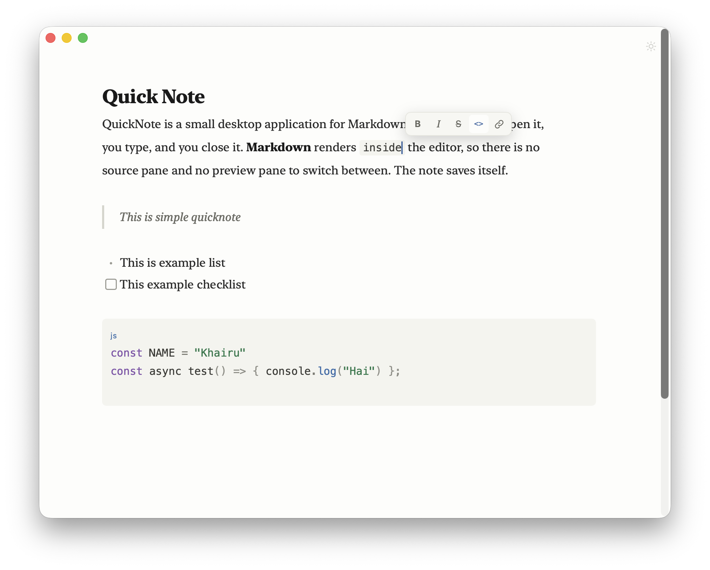

# QuickNote

> **Type it. Close it. It's still there.**

QuickNote is a small desktop application for Markdown quick notes. You open it,
you type, and you close it. Markdown renders inside the editor, so there is no
source pane and no preview pane to switch between. The note saves itself.

The note is one plain Markdown file that you own. Open it in any other editor,
copy it to a backup, or commit it to Git.

```
~/QuickNote/notes.md
```

## Install

macOS, with [Homebrew](https://brew.sh):

```bash
brew tap khairu-aqsara/quicknote
brew install --cask quicknote
```

Windows and Linux: download the installer for your platform from the
[Releases page](https://github.com/khairu-aqsara/quicknote/releases).

## What it does

- **Live Markdown.** Headings, bold, italic, strikethrough, lists, task lists,
  quotes, inline code, fenced code, links, images, and rules render as you
  type. The syntax marks appear again when the cursor enters their line.
- **Formatting bar.** Select text and a small bar appears above it: bold,
  italic, strikethrough, inline code, and link. Each button writes plain
  Markdown, and pressing it again takes the marks off. The bar leaves as soon
  as the selection does, so the default screen is still the editor alone.
- **Syntax highlighting.** Tag a fenced block with a language — ```` ```php ````
  — and it is highlighted. Around 100 languages are supported, each loaded only
  when a note first uses it. A block with no language stays plain.
- **Callouts.** Wrap anything in `:::success` … `:::` for a tinted block with a
  coloured edge. Also `info`, `warning`, `danger`, `note`, `tip`, `caution`,
  and `error`. The file keeps the plain `:::` lines, so other editors show them
  as text rather than mangling them.
- **Autosave.** The note is written 400 ms after you stop typing, when the
  window loses focus, when it closes, and never later than five seconds into
  continuous typing.
- **Never loses text.** Every write goes through a temporary file and a rename,
  so the note is never seen half-written. A crash mid-write is recovered on the
  next launch.
- **Safe with other editors.** If the file changed on disk while you had
  unsaved text, QuickNote keeps your version and saves the external one beside
  it as `notes.conflict-<timestamp>.md`. Neither version is lost.
- **Global shortcut.** `Ctrl+N` brings the window up from any application with
  the cursor ready. Press it again to hide. Settings changes the combination —
  a global shortcut takes those keys away from every other application, so pick
  one you do not use elsewhere.
- **Lives in the menu bar.** QuickNote sits beside the clock and the Wi-Fi
  icon, not in the Dock or the taskbar. Click the icon to open or hide the
  note. Right-click it to open the note or to quit.
- **Offline and private.** No account, no cloud, no telemetry, no network
  request of any kind.

## Keyboard

| Shortcut | Action |
|---|---|
| `Cmd/Ctrl + B` / `Cmd/Ctrl + I` | Bold / italic |
| `Cmd/Ctrl + Shift + X` | Strikethrough |
| `Cmd/Ctrl + E` | Inline code |
| `Cmd/Ctrl + K` | Link |
| `Cmd/Ctrl + S` | Write pending changes now |
| `Cmd/Ctrl + Z` / `Cmd/Ctrl + Shift + Z` | Undo / redo |
| `Cmd/Ctrl + F` | Find in the note |
| `Cmd/Ctrl + G` / `Cmd/Ctrl + Shift + G` | Find next / previous |
| `Cmd/Ctrl + +` / `Cmd/Ctrl + -` | Bigger or smaller text |
| `Cmd/Ctrl + 0` | Default text size |
| `Cmd/Ctrl + Enter` | Leave a code block, quote, table, or callout |
| `Cmd/Ctrl + ,` | Settings |
| `Cmd/Ctrl + W` | Hide the window, keep running |
| `Cmd/Ctrl + Q` | Quit |
| `Esc` | Close the find panel, the settings sheet, or a notice |
| `Ctrl+N` | Show or hide QuickNote from anywhere |

## Where things live

| File | Purpose |
|---|---|
| `~/QuickNote/notes.md` | Your note. Yours to move, back up, and commit. |
| `<app config>/config.json` | Theme, font size, note path, shortcut. Safe to edit by hand. |
| `<app config>/session.json` | Cursor, scroll, and window position. |

`<app config>` is `~/Library/Application Support/QuickNote` on macOS,
`%APPDATA%\QuickNote` on Windows, and `~/.config/quicknote` on Linux.

**Your note is never stored in those files.** Deleting the application's state
directory costs you a cursor position, nothing more.

## Build from source

You need [Node.js](https://nodejs.org) 20 or newer, [Rust](https://rustup.rs),
and the [Tauri prerequisites](https://tauri.app/start/prerequisites/) for your
platform.

```bash
npm install
npm run tauri:dev      # run it, with hot reload
npm run tauri:build    # produce installers for this platform
```

The first Rust compile takes several minutes. Later ones are fast.

Installers land in `src-tauri/target/release/bundle/`.

### Front end only

```bash
npm run dev
```

This opens the editor in a browser against a `localStorage` stand-in for the
filesystem. It is useful for working on the editor. It is not the application.

## Releases

| Platform | Format | Signed |
|---|---|---|
| macOS (Apple Silicon and Intel) | `.dmg` | Not yet |
| Windows x64 | `.msi`, `.exe` | Not yet |
| Linux x64 | `.AppImage`, `.deb` | Not yet |

All builds are unsigned, so the operating system shows a warning the first
time you run them.

- **Windows:** SmartScreen shows "Windows protected your PC". Choose
  **More info**, then **Run anyway**.
- **macOS:** Gatekeeper shows "Apple could not verify ... is free of malware".
  Use one of these to open it anyway:
  - Right-click (or Control-click) `QuickNote.app` and choose **Open**. A
    dialog with an **Open** button appears — click it once, and macOS
    remembers the choice after that.
  - If macOS already offered only **Move to Trash**, open **System Settings →
    Privacy & Security**, scroll down to the blocked-app notice, and click
    **Open Anyway**.
  - From a terminal: `xattr -d com.apple.quarantine /Applications/QuickNote.app`.
    Repeat this after every unsigned update.

To sign a macOS build yourself, set `signingIdentity` and `providerShortName`
in `src-tauri/tauri.conf.json`, or export `APPLE_SIGNING_IDENTITY`,
`APPLE_CERTIFICATE`, `APPLE_CERTIFICATE_PASSWORD`, `APPLE_ID`,
`APPLE_PASSWORD`, and `APPLE_TEAM_ID` before `npm run tauri:build`.

## What QuickNote is not

It is not Notion, Obsidian, or VS Code. There are no workspaces, no tabs, no
plugins, no sync, no accounts, and no database — by design. It holds one note
and tries to make that one note feel effortless.

See [the product requirements document](./QuickNote%20—%20Product%20Requirements%20Document%20v0.2.md)
for the reasoning behind every decision.

## Contributing

Read [CONTRIBUTING.md](./CONTRIBUTING.md). The short version: every feature has
to pass one question — *does this make QuickNote faster, simpler, or more
comfortable for a quick note?*

## License

[MIT](./LICENSE)
